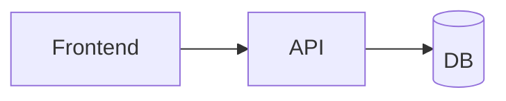

# kigarun
simple web app with low-cost AWS resources

## architecture



## setup

```
% xcode-select --install       
```

```
% cd ~/git/
% git clone git@github.com:msuz/kigarun.git
```

* https://code.visualstudio.com/download

* https://marketplace.visualstudio.com/items?itemName=corschenzi.mermaid-graphical-editor

```
% pip install bot3
```

```
% cd kigarun/infra && terraform init
```

## deploy

```
% terraform apply
```
