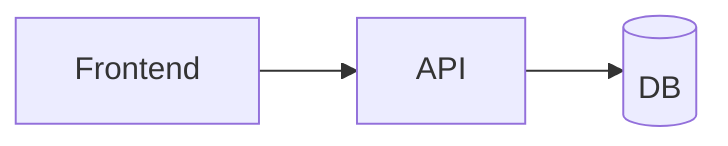

# kigarun
simple web app with low-cost AWS resources

## architecture

```mermaid
flowchart LR
  node_1["Frontend"]
  node_2["API"]
  node_3[("DB")]
  node_1 --> node_2
  node_2 --> node_3
```

## setup

TBD

## usage

TBD